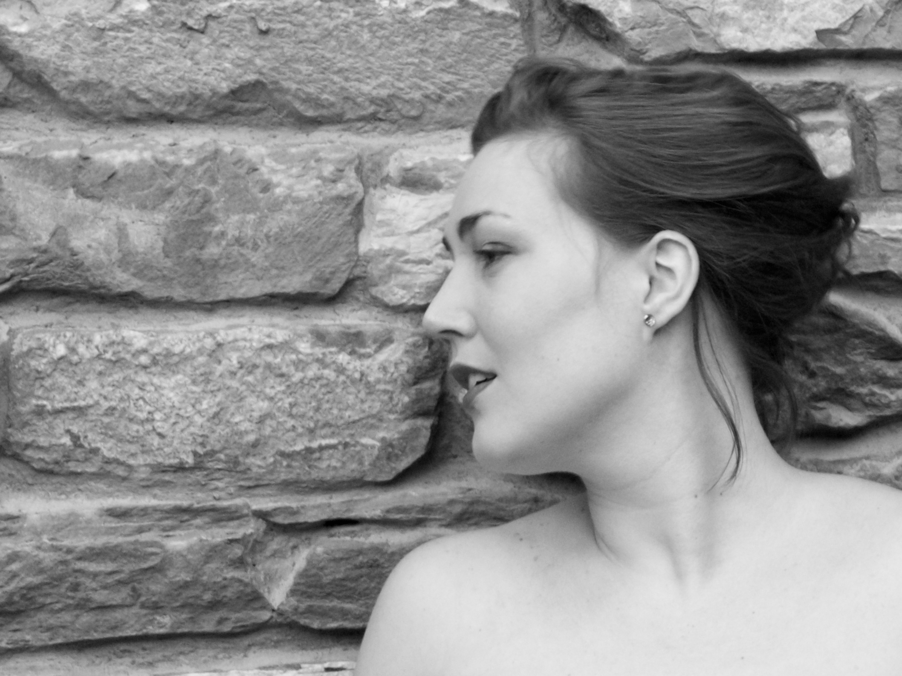

Die belgische Sopranistin Anne-Sophie Sevens trat im Jahr 2017 bei TOBS (Theater Orchester Biel Solothurn) als Sopranistin in Terrence McNallys Theaterstück «Masterclass» auf. Im Jahr 2015-2017 sang sie am Schweizer Opernstudio Biel Szenen der Micaela, Agathe, Elettra in «Idomeneo» und Marie in «Die verkaufte Braut». Sie interpretierte also Laetitia in «The Old maid and the thief» von Menotti (mit Orchester Biel Solothurn). Bei Opernwerkstatt im Jahr 2016 trat sie auf mit Gerhilde. 

Als Konzertsängerin sang sie in Belgien am Festival International des Minimes den «Fünf Liedern» von Alma Mahler und den «Liedern eines fahrenden Gesellen» von Gustav Mahler. Sie sang in den Konzerten der Davidfonds, Rotary und Euterpe Stiftungen, bei der Eröffnung des Joseph Jongen-Auditoriums, beim Festival Courants d’Air mit «Wesendonck-Lieder» von Richard Wagner und Festival Musiq‘3 in Flagey, Brüssel mit «Chanson perpétuelle» von Ernest Chausson. 

Im Jahr 2015 erhielt sie den Spezial-Förderpreis der Königlichen Konservatorium Brüssel. Im Jahr 2017 war sie Finalistin in das Bellincanto Wettbewerb in Bellinzona, Schweiz und in das Ljuba Welitsch Wettbewerb in Wien. Im Jahr 2017 war sie Teilnehmerin am Elizabeth Connell Wettbewerb in Covent Garden und im 2018 am Belvedere Wettbewerb in Jurmala.

Nachher ihren Master-Abschluss in Architektur, studierte Anne-Sophie für ihren Bachelor-Abschluss Gesang am LUCA School of Arts in Leuven mit Dina Grossberger und am Königlichen Konservatorium Brüssel für ihren Master-Abschluss mit Christine Solhosse und Marianne Pousseur und absolvierte in 2015 mit Auszeichnung. Neben ihrer Ausbildung in Belgien nahm Anne-Sophie teil an mehreren Meisterkursen mit Edda Moser, Vesselina Kasarova, Nadine Secunde und Gerd Uecker in Deutschland, Schweiz und Italien. Am Schweizer Opernstudio Biel im Jahr 2015-2017 studierte sie mit Mathias Behrends, Franco Trinca und Barbara Locher. 
Anne-Sophie spricht fliessend Deutsch, Englisch, Französisch, Holländisch und Italienisch.

Sie können ihren Lebenslauf [hier]({{ site.baseurl }}/assets/CV.pdf) herunterladen.

