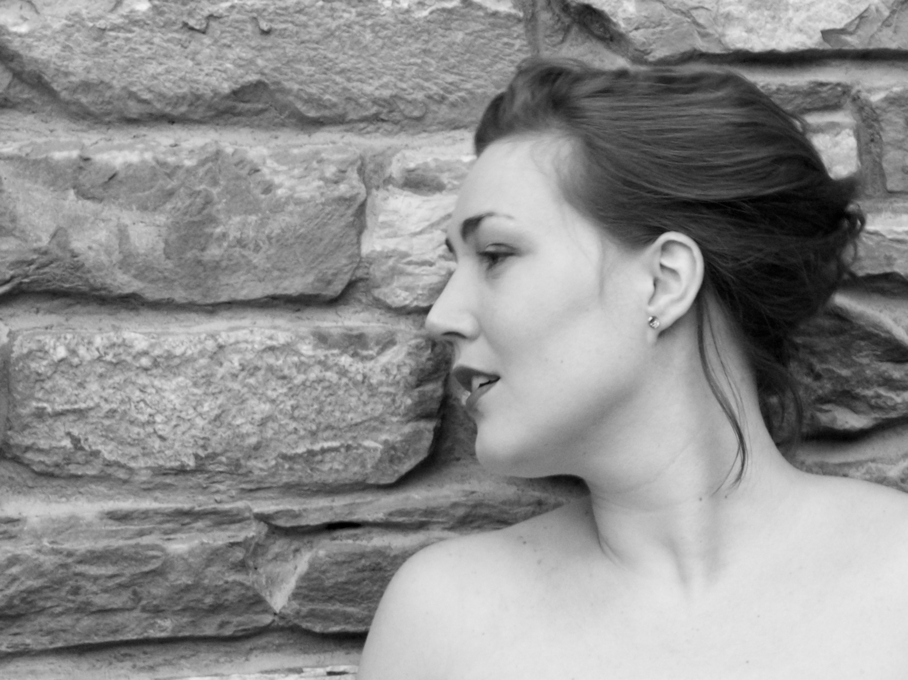

Anne-Sophie Sevens, Belgian Soprano recentely completed her studies at the Swiss Operastudio of Biel (Schweizer Opernstudio) with which she participated, among others, in the production of Idomeneo interpreting the role of Elettra and in the production of The Old Maid and the Thief in the role of Laetitia under the musical direction of Stefan Lano. Furthermore she interpreted opera scenes in the role of Micaela, Marie (Die verkaufte Braut), Agathe, Contessa, Desdemona. 
With Theater TOBS (Theater Orchester Biel Solothurn) she made her debut as Sopranistin in Masterclass of Terrence McNally, singing the aria of Lady Macbeth and with the International Belcanto Academy she appeared in the role of Lauretta in Gianni Schicchi.

Anne-Sophie performs regularly as a Recitalist. She performed at the Festival de Minimes in Brussels where she interpreted Alma Mahler’s Fünf Lieder and later Gustav Mahler’s Lieder eines fahrenden Gesellen. She participated at the Inauguration of the auditorium Joseph Jongen (CRB, Brussels), the Festival Courants d’Air (Brussels) and the Festival Musiq’3 (Flagey, Brussels). Further concerts were Le Lied postromantique (MIM, Brussels), La folle journée Mozart (MIM, Brussels) and concerts organized by Euterpe (Belgium), Davidsfonds Mariakerke (Belgium), Rotary Lochristi (Belgium). She participated in Oratorio such as Z. Kodaly’s Missa Brevis, J.S. Bach’s St John and G.F. Händel’s Dixit Dominus.

After obtaining a diploma in engineering-architecture, she entered into LUCA School of Arts in Leuven and for her Master she went to the Royal Conservatory of Brussels. Anne-Sophie received the Special Heritage Award 2015 of the Royal Conservatory of Brussels. In 2017 she was Prizewinner in the Bellincanto Competition in Bellinzona (Switzerland) and in the Ljuba Welitsch Singing Competition in Wien. 
At the Schweizer Opernstudio she studied with Mathias Behrends, Franco Trinca and Barbara Locher. She participated in several masterclasses, notably with Nadine Secunde, Ana Camelia Stefanescu, Edda Moser, Gerd Uecker, Paul Weigold and Anne Champert.

Anne-Sophie speaks fluently English, French, Dutch, German and Italian.

You can download her CV [here]({{ site.baseurl }}/assets/CV.pdf).

